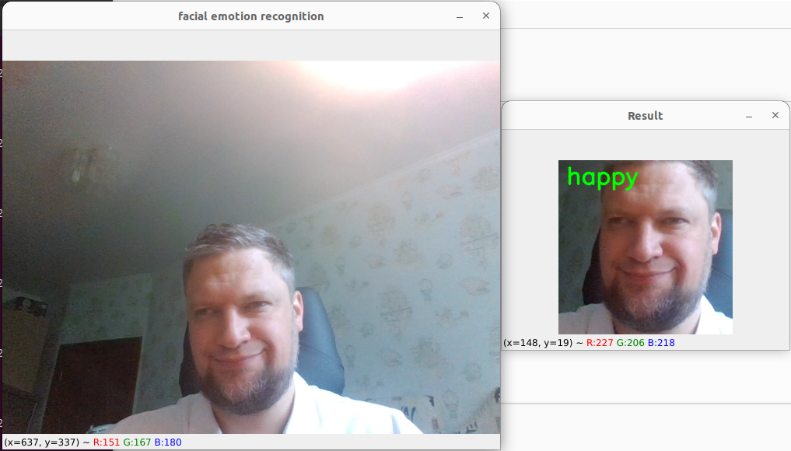

# Face emotions recognition for webcam using YOLOv8 and dlib face aligning
This is my coursework for Deep Learning module

# Description
The task requires you to predict 9 basic emotions such as:
- neutral
- anger
- contempt
- disgust
- fear
- happy
- sad
- surprise
- uncertain

The provided dataset or ImageNet-trained model can be used only. FPS should be higher than 3. <br>
My project is running at 13 FPS.



## Usage
```python
python main.py
```
